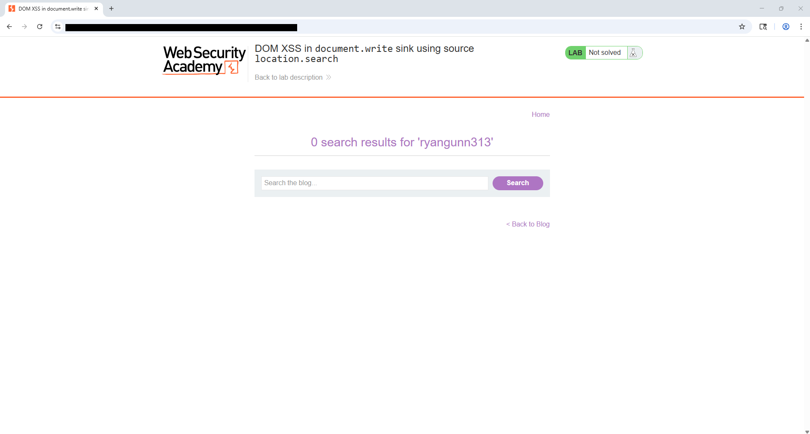
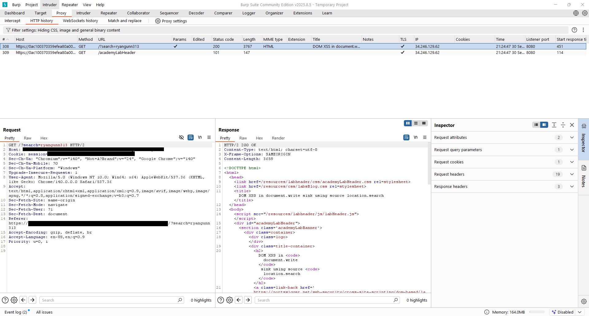
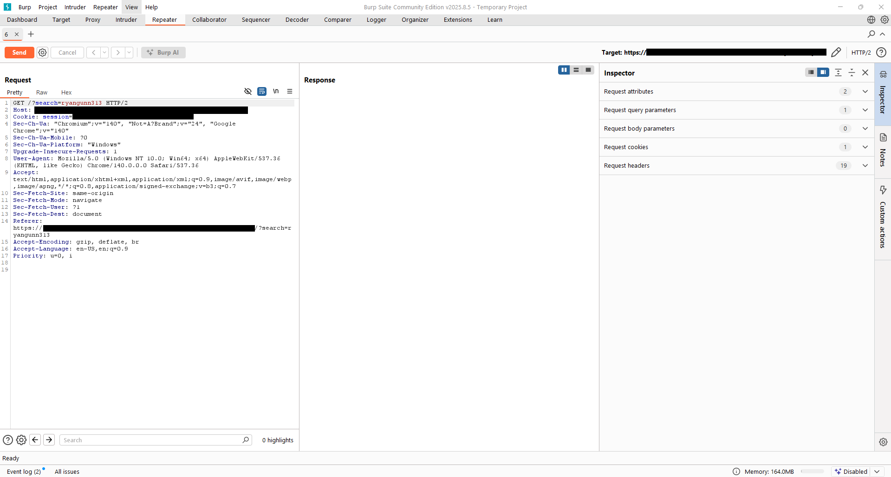
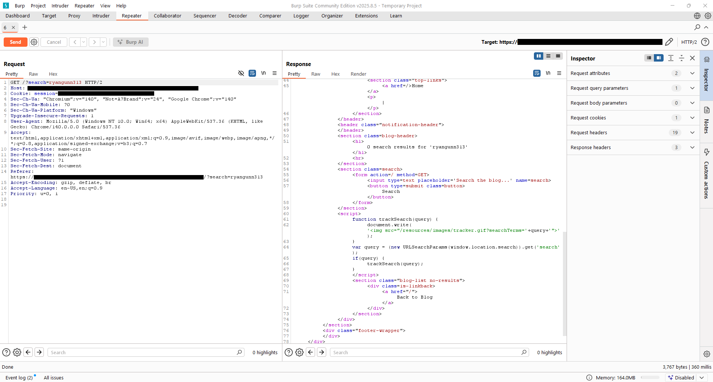
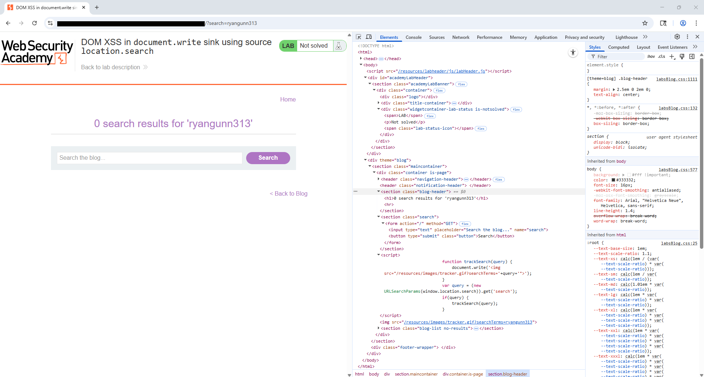
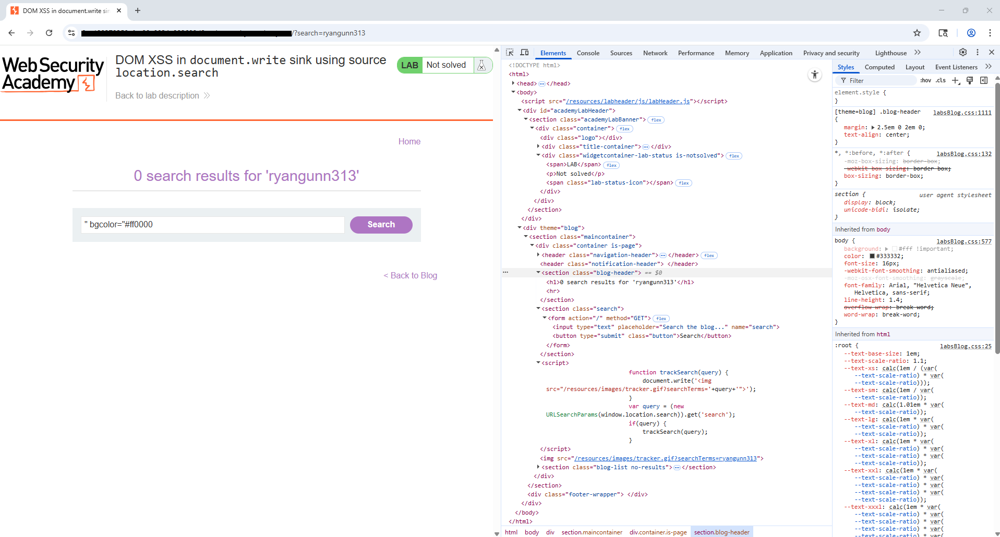
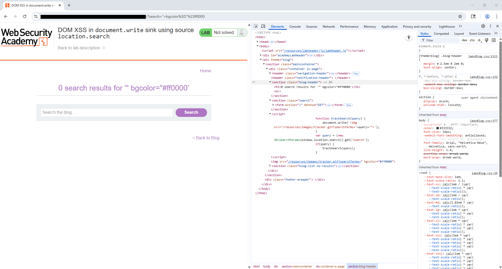
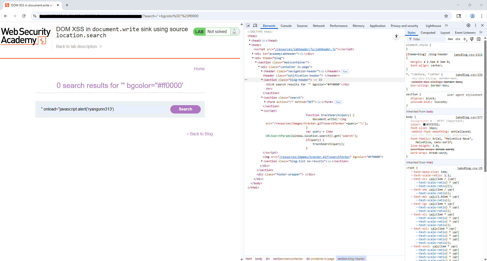
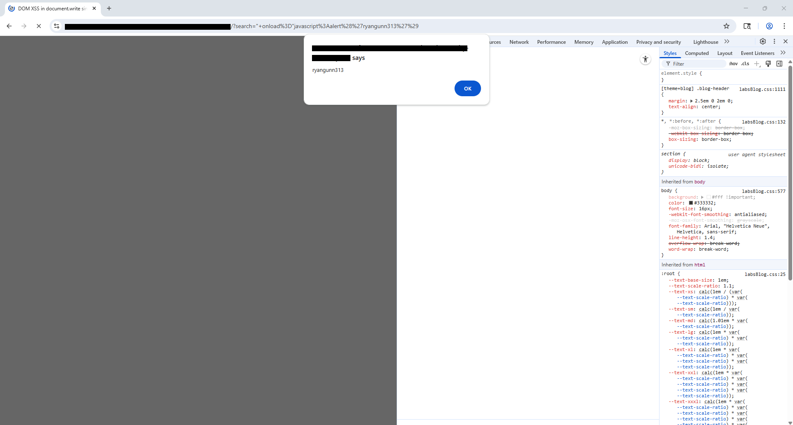

# Lab — DOM XSS in `document.write` sink using source `location.search` — 2025-10-02
**Lab URL:** https://portswigger.net/web-security/cross-site-scripting/dom-based/dom-write-using-location-search  
**Section:** XSS / DOM XSS  
**Difficulty:** Easy  
**Time spent:** ~20 minutes

---

## 🎯 Objective
The lab tests whether user-controlled data from `window.location.search` is written into the DOM using `document.write()` without proper sanitization/encoding, allowing a DOM-based XSS attack.

---

## 🛠️ Environment & Tools
- Platform: PortSwigger Web Security Academy (PortSwigger labs)  
- Browser: Chrome (developer screenshots)  
- Proxy/Tools: Burp Suite (HTTP history + Repeater), Chrome DevTools (Elements/Console)  
- Notes: Proxy (Burp) running and intercepting; JavaScript enabled (required to trigger DOM behavior).

---

## 🔍 Steps Taken (concise)
1. **Recon:** Visited the blog search page and performed a search for `ryangunn313` to confirm `?search=...` appears in the URL and that the page shows "0 search results for 'ryangunn313'". (See screenshot `01_search_page.png`.)  
2. **Inspect:** Loaded the page with Burp capturing the request to `/` with `?search=ryangunn313`. Examined the page source/JS and found a `trackSearch(query)` function that calls `document.write('');` — i.e., it uses `location.search` → `URLSearchParams(...).get('search')` → `document.write(...)`. (See `03_burp_proxy_http_history.png` and `06_devtools_inspection.png`.)  
3. **Payloads tried:** Tested simple characters like quotes and attribute-like values to see where injection is possible: `"+bgcolor="#ff0000`, then `"+onload="javascript:alert(1)`.  
4. **Bypass/technique:** The sink is `document.write()` injecting into HTML markup. Closing the existing attribute/element context and injecting an `onload` handler on an `img` tag worked. The payload was URL-encoded in the `search` query string to reach the `document.write()` content.  
5. **Final payload & injection point (sanitized):**  
   - Injection point: `search` query parameter (read from `location.search`)  
   - Final (demonstration) payload (sanitized in this report):  
     ```
     " onload="javascript:alert('REDACTED')
     ```  
   - URL encoded version used in the lab (example):  
     ```
     /?search="+onload%3D"javascript%3Aalert%28'ryangunn313'%29
     ```  
   - This causes `document.write()` to output an `` tag with the injected `onload` attribute, which executes the alert when the image is processed.

---

## ✅ Result
A JavaScript `alert()` executed in the page context (DOM XSS) after the crafted `search` parameter was written into the DOM by `document.write`. Evidence: browser alert dialog and DevTools showing the injected markup. (See screenshots below.)

---

## 🛡️ Mitigation Notes (for devs)
- **Avoid `document.write` with user data.** Do not build HTML by concatenating unsanitized user input.  
- **Context-aware encoding:** If you must insert data into HTML, perform proper encoding for the destination context (HTML attribute, HTML text, script, CSS, URL).  
- **Prefer safe DOM APIs:** Use DOM methods that set text (e.g., `textContent`) rather than `innerHTML`/`document.write` when adding user-controlled strings.  
- **CSP:** Deploy a robust Content Security Policy (CSP) that blocks inline scripts and disallows `unsafe-inline` where possible.  
- **Input validation:** Validate/normalize search terms (but keep in mind validation is not a substitute for output encoding).  
- **httpOnly cookies / sameSite:** For other attack vectors, ensure sensitive cookies have `HttpOnly` flag and `SameSite` attributes (not directly preventing DOM XSS, but reduces impact).

---

## 📚 Lessons Learned / Followups
- DOM sources like `location.search` are dangerous when combined with sink functions such as `document.write` or `innerHTML`.  
- Always verify the *context* (is the user string placed into HTML text or an attribute?) before deciding encoding strategy.  
- Practice creating safe server/client side search features using `textContent` or by building elements with `createElement`/`appendChild`.

---

## 📂 Artifacts (screenshots / evidence)
Below are the screenshots captured during the exercise. Each image is shown inline with a short description. Place these images in an `evidence/` folder next to this markdown file.

> **Note:** I didn't find `11_solved_page.png` in the evidence list you uploaded. If you add that file to the `evidence/` folder later, the markdown will render it automatically under the "12_solved_page.png" slot (or you can rename it to `12_solved_page.png` to match).

---

### 01_search_page.png  
*Initial blog search page with `ryangunn313` in the search box (UI).*  
[](evidence/01_search_page.png)

---

### 02_search_page_results.png  
*Search results page showing "0 search results for 'ryangunn313'".*  
[](evidence/02_search_page_results.png)

---

### 03_burp_proxy_http_history.png  
*Burp Proxy → HTTP history entry for the GET request with `?search=ryangunn313`. (Request + response visible.)*  
[](evidence/03_burp_proxy_http_history.png)

---

### 04_burp_repeater.png  
*Burp Repeater view for the request (raw request visible in the left pane).*  
[](evidence/04_burp_repeater.png)

---

### 05_burp_repeater_results.png  
*Burp Repeater response showing HTML/JS where `trackSearch()` / `document.write()` are present.*  
[](evidence/05_burp_repeater_results.png)

---

### 06_devtools_inspection.png  
*Chrome DevTools Elements view showing the `document.write` sink and current DOM (before injection).*  
[](evidence/06_devtools_inspection.png)

---

### 07_payload_in_search_box.png  
*Search box populated with the test payload before encoding (visible to the user).*  
[](evidence/07_payload_in_search_box.png)

---

### 08_devtools_injected_input.png  
*DevTools showing the injected markup after `document.write` (attribute injection visible).*  
[](evidence/08_devtools_injected_input.png)

---

### 09_executable_payload_in_search_box.png  
*Search box showing the executable payload string (after decoding/processing).*  
[](evidence/09_executable_payload_in_search_box.png)

---

### 10_browser_alert.png  
*Browser alert dialog triggered by the XSS (proof of execution).*  
[](evidence/10_browser_alert.png)

---

### 11_solved_page.png 
*Final solved lab page showing success banner, injected payload visible in page and DevTools.*  
[](evidence/11_solved_page.png)


