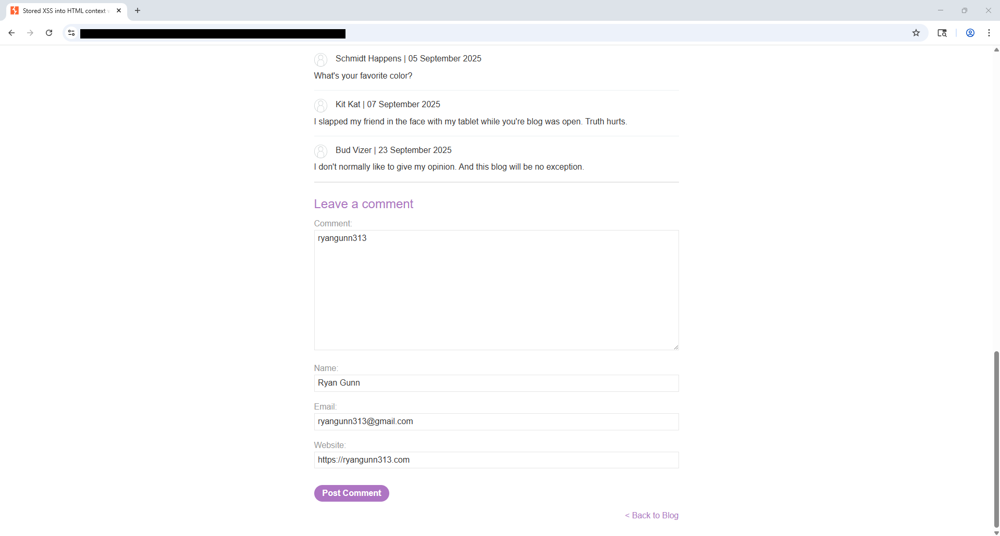
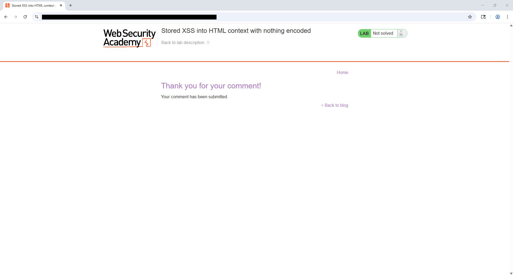
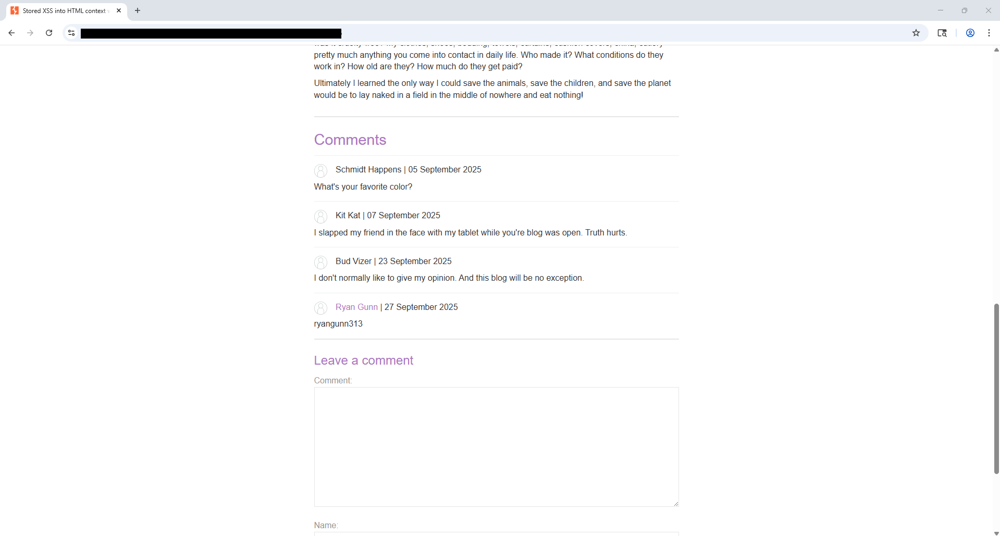
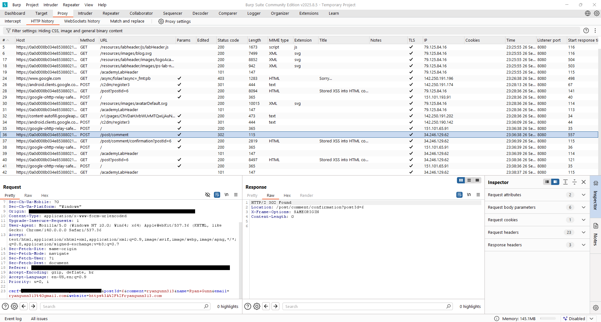
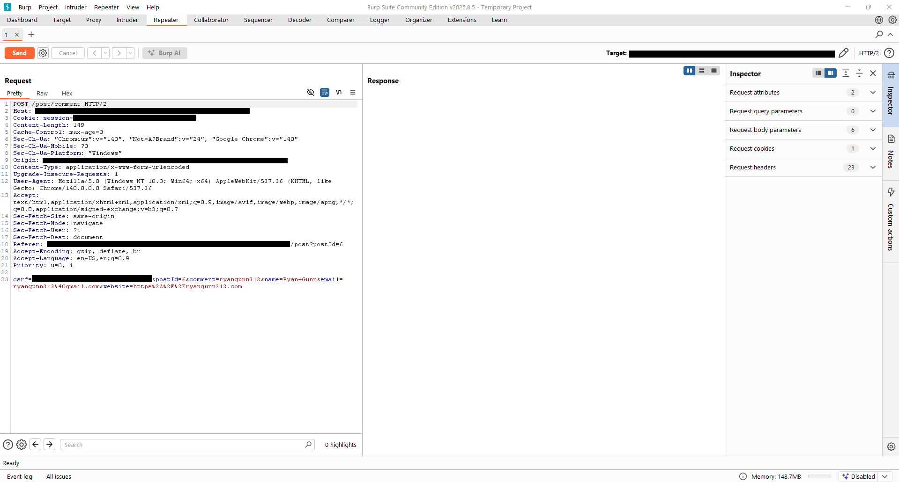
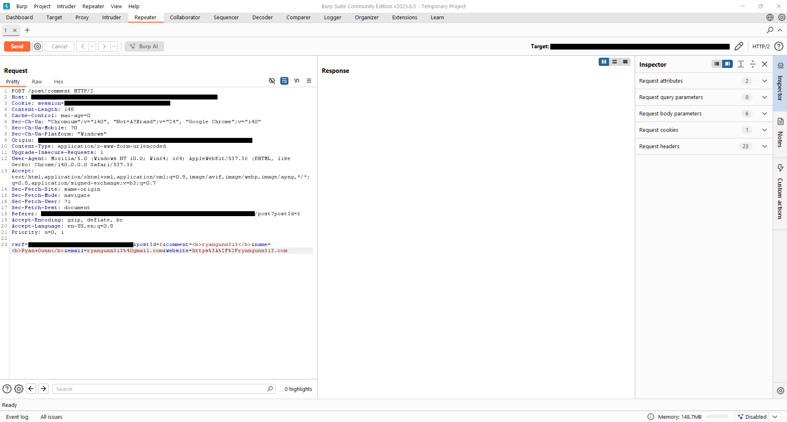

# Lab — Stored XSS into HTML context with nothing encoded — 2025-09-26
**Lab URL:** [https://portswigger.net/web-security/cross-site-scripting/stored/lab-html-context-nothing-encoded](https://portswigger.net/web-security/cross-site-scripting/stored/lab-html-context-nothing-encoded)  
**Section:** XSS  
**Difficulty:** easy  
**Time spent:** ~15m

---

## 🎯 Objective
Demonstrate stored XSS: submit input that is persisted by the application and later rendered into a page's HTML without encoding, allowing JavaScript execution when the comment is displayed.

---

## 🛠️ Environment & Tools
- Platform: PortSwigger Academy (lab environment)  
- Tools: Chrome, Burp Suite (Proxy → Intercept → Repeater)  
- Notes: Browser proxied through Burp, Burp CA cert installed in profile. Intercept→send-to-repeater workflow used to preserve CSRF token and session cookie.

---

## 🔍 Steps Taken (concise)
1. Recon:
   - Located blog post comment form and noted form fields (`comment`, `name`, `email`, `website`) and `csrf` parameter.
   - Observed comment rendering in the post comments list.
2. Payloads tried (sanitized list):
   - Simple text, angle-bracket encoded attempts, and then a standard `` (injected into the comment field; stored and later rendered in HTML)

---

## ✅ Result
- After submitting the comment (and confirming the submission page), the comment appeared in the comments list and the JavaScript executed (alert shown).  
- Evidence: confirmation page returned and the stored comment displayed unescaped in the comments section.

---

## 🛡️ Mitigation Notes (for devs)
- HTML-encode user-supplied content before rendering in HTML contexts (e.g., convert `<`/`>` to `&lt;`/`&gt;`).  
- Use context-aware escaping libraries (templating frameworks or dedicated escaping routines).  
- Implement/verify a robust Content Security Policy (CSP) as defense-in-depth (do not rely only on CSP).  
- Ensure session-bound anti-CSRF tokens are validated server-side (they were present; capture→replay preserved them).

---

## 📚 Lessons Learned / Followups
- Capture→replay workflow is essential when CSRF tokens/cookies are enforced — don’t attempt to guess tokens.  
- Burp TLS handshake errors can block Repeater; keep a dedicated browser profile with Burp cert installed.  

---

## 📂 Artifacts
Below are the screenshots captured during the exercise.

### 01_lab_homepage.png

### 02_submit_comment.png

### 03_comment_confirmation.png

### 04_comment_display.png

### 05_burp_proxy_http_history.png

### 06_burp_repeater_raw_request.png

### 07_burp_repeater_html_injection.png

### 08_burp_repeater_plain_request.png

### 09_burp_repeater_error.png

### 10_stored_xss_executed.png

### 11_lab_solved.png

